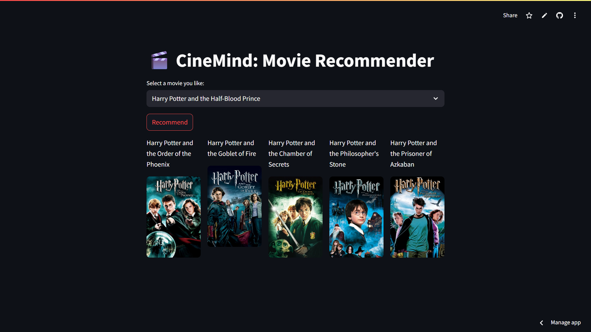

🎬 CineMind - Movie Recommender System
CineMind is a simple yet effective Movie Recommender System built using the Bag of Words model and cosine similarity. It suggests 5 similar movies based on the selected title, using metadata like genres, keywords, cast, and crew.

📸 Demo

🚀 How It Works
Uses a preprocessed movie dataset (movies_dict.pkl)

Computes similarity using cosine similarity on bag-of-words vectors (similarity.pkl)

When a movie is selected, top 5 most similar movies are recommended along with their posters via TMDb API

🧠 Features
Clean UI built using Streamlit

Movie poster integration via TMDb API

Google Drive integration for loading large .pkl files dynamically

🛠️ Tech Stack
Python

Streamlit

Pandas

Scikit-learn

TMDb API

Google Drive + gdown (for loading .pkl files)